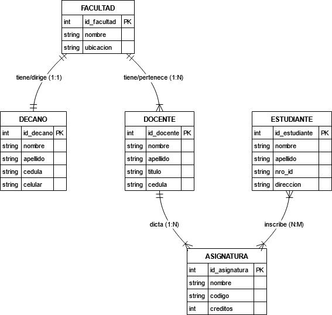

Esquema Base de Datos de Facultad

Este proyecto representa el diseño de una base de datos para la gestión de una facultad, incluyendo la relación entre facultades, docentes, asignaturas, estudiantes y decanos.

Modelo Relacional

El modelo incluye las siguientes entidades principales:

1. FACULTAD

id_facultad (PK): Identificador único de la facultad.

nombre: Nombre de la facultad.

ubicación: Ubicación de la facultad.

2. DECANO

id_decano (PK): Identificador único del decano.

nombre: Nombre del decano.

apellido: Apellido del decano.

cédula: Número de identificación del decano.

celular: Número de contacto del decano.

3. DOCENTE

id_docente (PK): Identificador único del docente.

nombre: Nombre del docente.

apellido: Apellido del docente.

título: Título académico del docente.

cédula: Número de identificación del docente.

4. ASIGNATURA

id_asignatura (PK): Identificador único de la asignatura.

nombre: Nombre de la asignatura.

código: Código de la asignatura.

créditos: Cantidad de créditos que otorga la asignatura.

5. ESTUDIANTE

id_estudiante (PK): Identificador único del estudiante.

nombre: Nombre del estudiante.

apellido: Apellido del estudiante.

nro_id: Número de identificación del estudiante.

dirección: Dirección del estudiante.

Relaciones

FACULTAD → DECANO (1:1): Cada facultad tiene un único decano.

FACULTAD → DOCENTE (1:M): Una facultad tiene múltiples docentes.

DOCENTE → ASIGNATURA (N:M): Un docente puede dictar varias asignaturas, y una asignatura puede ser dictada por varios docentes.

ESTUDIANTE → ASIGNATURA (N:M): Un estudiante puede inscribirse en múltiples asignaturas, y una asignatura puede tener múltiples estudiantes.

Implementación con JPA

Este modelo se implementa utilizando Java Persistence API (JPA), lo que permite mapear las entidades a tablas en una base de datos relacional. Se recomienda utilizar Hibernate como proveedor de JPA y configurarlo con Spring Boot para facilitar la gestión de las entidades y sus relaciones.

Diagrama Entidad-Relación en Mermaid

    erDiagram
    FACULTAD {
        int id_facultad PK
        string nombre
        string ubicacion
    }
    DECANO {
        int id_decano PK
        int id_facultad FK
        string nombre
        string apellido
        string cedula
        string celular
    }
    
    DOCENTE {
        int id_docente PK
        int id_facultad FK
        string nombre
        string apellido
        string titulo
        string cedula
    }
    
    ASIGNATURA {
        int id_asignatura PK
        int id_docente FK
        string nombre
        string codigo
        int creditos
    }
    
    ESTUDIANTE {
        int id_estudiante PK
        string nombre
        string apellido
        string nro_id
        string direccion
    }
    
    ESTUDIANTE_ASIGNATURA {
        int id_estudiante FK
        int id_asignatura FK
    }
    
    FACULTAD ||--||DECANO : "tiene/dirige (1:1)"
    FACULTAD ||--|{DOCENTE : "tiene/pertenece (1:N)"
    DOCENTE ||--|{ASIGNATURA : "dicta (1:N)"
    ESTUDIANTE }|--|{ASIGNATURA : "inscribe (N:M)"

